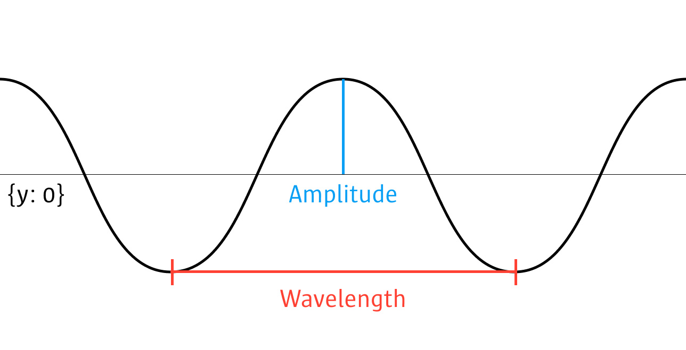

**Parametric Design**
# Math

When creating parametric designs, math, especially geometry, will be your constant companion. In this short overview I will cover a few basics, which will come in handy when creating your first code-driven designs.

## The circle

See `circle` and `arc` in the [drawing basics](../02-basics/index.md).

A circle is defined by it's `centre` and `radius`. A circle's diameter is `radius * 2`. The circumference of the circle is `Math.PI * 2 * radius`. The circumference kan also be described by points located at distance `radius` between 0 and 360 degrees. And the surface or area of a circle is `Math.PI * radius²`.


> When you are using circles to visualise data, have in mind, that the surface of the circle increases exponentially to the radius. So do not use the radius as your scale, use the surface: `const radius = Math.sqrt(surfaceSize / Math.PI);`


## Radians
In many functions you will need to use radians as an input, not degrees. The conversion is quite simple: `Math.PI` equals `180°`. So if we want to calculate the radians for a specific angle, we only need the following formula:

```js
const rad = Math.PI / 180 * angleInDegrees;
```

And then reverse the whole thing:

```js
const angleInDegrees = rad * 180 / Math.PI;
```

## Polar coordinates

Our normal coordinate system is described by `x, y (, z)`. An alternate coordinate system is the polar coordinate system. In this system, each point's location is described by `radius` and `angle`. To convert it into our normal coordinate system two simple conversions help us:

```js
const rad = Math.PI / 180 * angle;
const x = radius * Math.cos(rad);
const y = radius * Math.sin(rad);
```

> The functions above also take negative angles (see image below for an example).


We can als do the reverse to calculate `angle` and `radius` from `x, y`:

```js
const radius = Math.sqrt( x * x + y * y );
const angle = Math.atan2(y, x) * 180 / Math.PI;
```

## Distances


Some of you might remember Pythagoras and his triangle `a² + b² = c²`. This is the basis for distance calculations in our two dimensional coordinate system:

```js
// Point #1
const p1x = 10;
const p1y = 10;

// Point #2
const p2x = 40;
const p2y = 20;

const distX = p1x - p2x;
const distY = p1y - p2y;

const distance = Math.sqrt(
  distX * distX + 
  distY * distY
);
```

> For short variable names, simply writing `a * a` is the shortest. If you have a long variable name, there is a shorter Version: `Math.pow(a, 2)`. This comes in even more handy when you have a higher exponent: `Math.pow(a, 5)`.

## Curves

Curves are very complex, the following examples will provide some starting points, particullarly from a parametric design perspective, rather than a mathematical/geometric perspective.

# sin/cos



Through sin/cos we can generate waves. The problem is, the normal wavelength is `Math.PI * 2` and it starts at `0`. So for one wave across our sketch (`sketchWidth`) we would need to use the following:

```js
const sketchHeight = 400;
const sketchWidth = 400;
beginShape();
for (let x = 0; x < sketchWidth; x += 1) {
  vertex(x, sin(Math.PI * 2 / sketchWidth * x) + sketchHeight / 2);
}
endShape();
```

But we would hardly see anything, because the amplitude is 1. But we can control the amplitude (distance between highest and lowest point):

```js
const sketchHeight = 400;
const sketchWidth = 400;
const amplitude = 200;
beginShape();
for (let x = 0; x < sketchWidth; x += 1) {
  vertex(x, sin(Math.PI * 2 / sketchWidth * x) * amplitude + sketchHeight / 2);
}
endShape();
```

We could for example feed those two functions into our polar coordinate system:

```js
const sketchHeight = 400;
const sketchWidth = 400;
beginShape();
for (let angle = 0; angle < 360; angle += 1) {
  const radius = 50 + cos(Math.PI * 20 / 360 * angle) * 20;
  const rad = Math.PI / 180 * angle;
  const x = radius * Math.cos(rad);
  const y = radius * Math.sin(rad);
  vertex(x + sketchWidth / 2, y + sketchHeight / 2);
}
endShape();
```

## Rule of Three (Dreisatz)
The *Rule of Three* is mostly of interest, if your are looking at ratios/relationships between numbers. For example we define that a rectangle with the width of `400px` equals **100%**. Now we want to know the width for a rectangle representing **30%**. Using the **rule of three** we can:

```js
const fullWidth = 400;
const fullPercentage = 100;

const searchPercentage = 30;
const searchWidth = fullWidth / fullPercentage * searchPercentage;
```

So we require a pair defining the relationship between two scales (pixel and percentage). And from there on, we can use other values, from either scale (pixel or percentage) to calculate the corresponding value, by dividing the the pair and multiplying by the addition value, to find this value's corresponding value.
