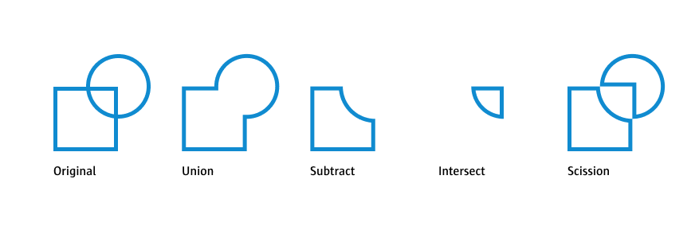

**Parametric Design**

# From 2D to 3D

## SVG shapes to 3D objects

Working with 3D-objects is a bit more complex than dealing with 2D designs. But in many cases, it is not even neccessary to directly switch to 3D, but remain in 2D and then use the 2D export (SVG) as a basis to continue working in a GUI-based 3D software like [Fusion 360](https://www.autodesk.com/products/fusion-360/overview), [Rhino](https://www.rhino3d.com/) or [Blender](https://www.blender.org/). Following an example of importing an SVG into Fusion and using the extrusion tool to turn a 2D shape into a 3D form:

### Blender
<video width="1920" height="1080" style="max-width:100%; height: auto;" controls>
  <source src="https://fhp-video-hosting.s3.eu-central-1.amazonaws.com/06-3d-intro/blender.mp4" type="video/mp4">
  Your browser does not support the video tag.
</video>

### Fusion 360
<video width="1920" height="1080" style="max-width:100%; height: auto;" controls>
  <source src="https://fhp-video-hosting.s3.eu-central-1.amazonaws.com/06-3d-intro/fusion.mp4" type="video/mp4">
  Your browser does not support the video tag.
</video>

### Rhino
<video width="1920" height="1080" style="max-width:100%; height: auto;" controls>
  <source src="https://fhp-video-hosting.s3.eu-central-1.amazonaws.com/06-3d-intro/rhino.mp4" type="video/mp4">
  Your browser does not support the video tag.
</video>

## 3D object from code

But sometimes we want to directly create a 3D shape from code. 2D pixel and vector graphics are very forgiving, if objects overlap or paths are not closed, the output might not look perfect, but its still fine. When building 3D objects for rapid prototyping (e.g. 3D-printing or CNC), we need to make sure that our solid bodies are correctly constructed, otherwise the software we will use to send our design to the milling or printing machines will fail.

The open source community has developed the [OpenSCAD](https://openscad.org/) software. In contrast to tools like Fusion 360, OpenSCAD's focus is script/code-based design, which makes this tool great for parametric design. Over the years developers have ported the OpenSCAD programming language to other languages like [JavaScript](https://github.com/jscad/OpenJSCAD.org) or [Python](https://github.com/CadQuery/cadquery). Thanks to this work, we can continue using our JavaScript skills to build our own 3D objects. Similar to p5js' online editor, there is a new platform with similar capabilities for OpenSCAD: [cadhub.xyz](https://cadhub.xyz/) (this website is a community project still under development).

### OpenSCAD
<video width="1920" height="1080" style="max-width:100%; height: auto;" controls>
  <source src="https://fhp-video-hosting.s3.eu-central-1.amazonaws.com/06-3d-intro/openscad-final.mp4" type="video/mp4">
  Your browser does not support the video tag.
</video>

# OpenJSCAD / JSCAD

## Inspect 3D project in the browser

IMPORTANT: If you have not updated your `3d-example` folder do so [now](fix.md)!

To create your first 3D project, the process is the same as for p5js, we just use a different boilerplate. Duplicate the `3D-example` folder. You will find a couple of commands as examples in the `index.js` file. We will go through all those commands in a moment. Open the `index.html` in your new folder with the *Go Live* extension. When you make changes to the `index.js` file and save, the website in your browser should reload automatically. (Please note that the last rotation and zoom of the camera will be reset).

You can use your mouse-wheel or trackpad scrolling to zoom in and out. Hold your mouse-pressed and drag to rotate the coordinate system. More controls are explained under the settings button in the upper right. There you can also change language and theme. The most interesting part is the export feature. In the upper left you find a dropdown with a variety of formats. For our use cases the binary STL file is best suited.

You can find the full reference for all JSCAD features [here](https://openjscad.xyz/docs).

## Boilerplate

<video width="1920" height="1080" style="max-width:100%; height: auto;" controls>
  <source src="https://fhp-video-hosting.s3.eu-central-1.amazonaws.com/06-3d-intro/basics.mp4" type="video/mp4">
  Your browser does not support the video tag.
</video>

```js
// importing jscad functions
const jscad = require('@jscad/modeling');
// creating shortcuts
const {cube} = jscad.primitives;

// this is where we draw our shapes
const main = () => {
  const cubeObject = cube();

  // when we are done we return one shape or an array of shapes
  return cubeObject;
}

// this lets javascript know what to execute once we import this
module.exports = { main }
```

Let's start from the top. In our p5js boilerplate everything is ready to use. Here we need to load the JSCAD library ourselves. `const jscad = require('@jscad/modeling');` loads the JSCAD commands. Some commands are hidden deep inside the JSCAD library structure. To create a cube, we need to write `jscad.primitives.cube()`. To help us write less code, we can import specific commands and then directly use them: `const {cube} = jscad.primitives;` now we can write `cube()`. Here is another example: `jscad.transforms.translate()` > `const { translate } = jscad.transforms;` `translate();`.

```js
const main = () => {
  // Here we draw
};
```

Similar to p5js' `draw()` the `main()` is our drawing function. Please note, that in contrast to p5js this function is only called once and not as a loop.

> `() => {}` is short for `function () {}`

> `const main = () => {};` stores the function in the variable `main`, so we can execute it with `main();`.

The `main` function needs to return something that the system can render for us. The return is either a single 3D body or an array of bodies:

```js
const main = () => {
  const shapes = [];
  shapes.push(cube());
  shapes.push(cube());
  return shapes;
};
```

## Function Paremeters vs. Objects

In p5js commands like `rect` take a certain amount of parameters: `rect(x, y, width, height)`. In JSCAD most functions take a single object with several properties: `cube({center: [0,0,0], size: 2})`. This approach can have a lot of advantages, e.g. you can create a parameter object and pass it to multiple commands or modify only certain aspects of the object:

```js
const main = () => {
  const shapes = [];
  const cubeProps = {
    size: 1,
    center: [0, 0, 0]
  };
  for (let c = 0; c < 10; c += 1) {
    shapes.push(translate([0, 0, c * 2], cube(cubeProps));
  }
  return shapes;
};
```


## 2D-Primitives

<video width="1920" height="1080" style="max-width:100%; height: auto;" controls>
  <source src="https://fhp-video-hosting.s3.eu-central-1.amazonaws.com/06-3d-intro/2d-primitives-final.mp4" type="video/mp4">
  Your browser does not support the video tag.
</video>

```js
const {line, arc, circle, ellipse, rectangle} = jscad.primitives;
```

2D primitives are often a good start. You can use extrusion and expansion commands, to turn 2D shapes into 3D bodies (see below).

A documentation of all primitives can be found [here](https://openjscad.xyz/docs/module-modeling_primitives.html). 

### Line

The line command takes two arrays of two numbers each:

```js
const shape = line([
  [x1, y1],
  [x2, y2]
]);
```

> You can also pass an array with more points to create a path.

### Arc

The arc also produces a line and works similar to the p5js arc function:

```js
const shape = arc({
  center: [0, 0],
  radius: 1,
  startAngle: 0,
  endAngle: Math.PI * 2, //full arc
  segments: 32 // level of detail
});
```

> Most properties in JSCAD are optional and have a default value, so you only need to provide the ones you really need.

### Circle

```js
const shape = circle({
  center: [0, 0],
  radius: 1,
  startAngle: 0,
  endAngle: Math.PI * 2, //full arc
  segments: 32 // level of detail
});
```

> Circle looks exactly like arc, the important difference is, that arc returns a line and circle a polygon.

### Ellipse

Circle and ellipse take similar parameters, radius is an array for ellipse, defining the radius on x and y axis:

```js
const shape = ellipse({
  center: [0, 0],
  radius: [1,1],
  startAngle: 0,
  endAngle: Math.PI * 2, //full arc
  segments: 32 // level of detail
});
```

> Most round features, like ellipses, spheres or rounded corners, have a segment parameter. This defines the level of detail of curves. More segments lead to rounder curves, but also more complex objects (bigger files, longer rendering times, etc.).

### Rectangle

```js
const shape = rectangle({
  size: [2, 2],
  center: [0, 0, 0]
});
```


## 3D-Primitives

<video width="1920" height="1080" style="max-width:100%; height: auto;" controls>
  <source src="https://fhp-video-hosting.s3.eu-central-1.amazonaws.com/06-3d-intro/3d-primitives.mp4" type="video/mp4">
  Your browser does not support the video tag.
</video>

```js
const {cube, sphere, cylinder} = jscad.primitives;
```

A documentation of all primitives can be found [here](https://openjscad.xyz/docs/module-modeling_primitives.html).

### Cube

```js
const shape = cube({
  size: 1,
  center: [0, 0, 0]
});
```

### Sphere

```js
const shape = sphere({
  radius: 1,
  center: [0, 0, 0]
});
```

### Cylinder

```js
const shape = cylinder({
  center: [0, 0, 0],
  height: 2,
  radius: 1,
  segments: 32
});
```

There are a few more 3D primitives to explore, examples for how to construct them are included in the boilerplate:

- [cuboid](https://openjscad.xyz/docs/module-modeling_primitives.html#.cuboid)
- [roundedCuboid](https://openjscad.xyz/docs/module-modeling_primitives.html#.roundedCuboid)
- [geodesicSphere](https://openjscad.xyz/docs/module-modeling_primitives.html#.geodesicSphere)
- [ellipsoid](https://openjscad.xyz/docs/module-modeling_primitives.html#.ellipsoid)
- [roundedCylinder](https://openjscad.xyz/docs/module-modeling_primitives.html#.roundedCylinder)
- [cylinderElliptic](https://openjscad.xyz/docs/module-modeling_primitives.html#.cylinderElliptic)
- [torus](https://openjscad.xyz/docs/module-modeling_primitives.html#.torus)

## From 2D to 3D 

When ever we modify something in JSCAD, not matter if extrusion or transformation, we pass the shape we want to modify into that command and the command will return the modified version of the shape, which we can then store in a new variable (or the same).

### Extruding

<video width="1920" height="1080" style="max-width:100%; height: auto;" controls>
  <source src="https://fhp-video-hosting.s3.eu-central-1.amazonaws.com/06-3d-intro/extrude-final.mp4" type="video/mp4">
  Your browser does not support the video tag.
</video>

```js
const {extrudeRectangular, extrudeLinear, extrudeRotate} = jscad.extrusions;
```

Extrusion is the process of taking a geometry and extending along one dimension.

#### ExtrudeLinear

Linear extrude allows you to extrude on the z-axis `{height: 20}`:


```js
const circleShape = circle({
    radius: 5,
    segments: 6,
    center: [0, 0, 0]
});

const extrudeShape = extrudeLinear({height: 20}, circleShape);
```

You can add a rotation to the extrusion `twistAngle` and how many steps inbetween should be created `twistSteps`:


```js
const circleShape = circle({
    radius: 5,
    segments: 6,
    center: [0, 0, 0]
});

const extrudeShape = extrudeLinear({
  height: 20,
  twistAngle: Math.PI * 2,
  twistSteps: 12
}, circleShape);
```

The rotation works along the z-axis relative to `[0,0,0]`. If an object is not located on `[0,0,0]`, the twist effect from above will look different:


```js
const circleShape = circle({
    radius: 5,
    segments: 6,
    center: [0, 0, 4]
});

const extrudeShape = extrudeLinear({
  height: 20,
  twistAngle: Math.PI * 2,
  twistSteps: 12
}, circleShape);
```


#### extrudeRectangular

For this extrusion imagine a cube walking along the outline of the shape and, thereby, creating the extrusion. You can define size and heigth of the rectangle and result ing extrusion:


```js
const circleShape = circle({
    radius: 5,
    segments: 6,
    center: [0, 0, 0]
});

const extrudeShape = extrudeRectangular({
  size: 1,
  height: 1
}, circleShape);
```

#### extrudeRotate

For this extrusion the shape is rotated around the z-axis, the angles define start and end, segments the amount of steps:


```js
const circleShape = circle({
    radius: 5,
    segments: 6,
    center: [0, 0, 0]
});

const extrudeShape = extrudeRotate({
  angle: Math.PI / 180 * parameters.end,
  startAngle: Math.PI / 180 * parameters.start,
  segments: parameters.segments
}, circleShape);
```

In the above example the shape is located on `[0,0,0]` and, therefore, rotated around itself. Similar to `extrudeLinear`, adding an offset, the shape rotates differentyl:


```js
const circleShape = circle({
    radius: 5,
    segments: 6,
    center: [0, 0, 4]
});

const extrudeShape = extrudeRotate({
  angle: Math.PI / 180 * parameters.end,
  startAngle: Math.PI / 180 * parameters.start,
  segments: parameters.segments
}, circleShape);
```

## Colors

<video width="1920" height="1080" style="max-width:100%; height: auto;" controls>
  <source src="https://fhp-video-hosting.s3.eu-central-1.amazonaws.com/06-3d-intro/3d-colors.mp4" type="video/mp4">
  Your browser does not support the video tag.
</video>

```js
const {colorize, colorNameToRgb} = jscad.colors;
```

Colors can help us for prototyping and design our shapes. But have in mind, that depending on what you are going to do with your 3D object, you will likely have to reassign materials to your shapes.

We can either use RGB values:

```js
const shape = colorize([R, G, B], cube());
```

> Important: RGB are not 

Or use color names:

```js
const shape = colorize(colorNameToRgb('black'), cube());
```

## Transformations

<video width="1920" height="1080" style="max-width:100%; height: auto;" controls>
  <source src="https://fhp-video-hosting.s3.eu-central-1.amazonaws.com/06-3d-intro/transforms.mp4" type="video/mp4">
  Your browser does not support the video tag.
</video>

```js
const {translate, rotate, scale, center, align} = jscad.transforms;
```


A documentation of all transformations can be found [here](https://openjscad.xyz/docs/module-modeling_transforms.html).

Similar to the p5js coordinate system transformations, we can transform individual objects. In contrast to p5js we don't transform the whole coordinate system, but only individual objects.

### Translate

Move object along three dimensions:

```js
const shape = translate([0, 0, 5], cube());
```

### Rotate

Rotate object along x/y/z-axis:

```js
const shape = rotate([0, 0, Math.PI / 2], cube());
```

### Scale

Resize (multiply) along dimensions:

```js
const shape = scale([0, 2, 0], cube());
```

### Center

The center function allows us to center an object on one or multiple axis. If all set to `true` its placed on the center at `[0,0,0]`:

```js
const shape = center([true, true, true], cube());
```

### Align

After creating multiple objects, `align` allows you to align an array of objects:

```js
const shapes = [
  cube({center: [0, 0, 10]}),
  cube({center: [0, 10, 20]}),
  cube({center: [10, 0, 30]})
];

const alignedShapes = align(
  {
    modes: ['center', 'max', 'none'], // align along axis: center, min, max, none
    realtiveTo: [0,0,0]
  },
  shapes
);
```

### Combining multiple transforms
<video width="1920" height="1080" style="max-width:100%; height: auto;" controls>
  <source src="https://fhp-video-hosting.s3.eu-central-1.amazonaws.com/06-3d-intro/transform-combinations.mp4" type="video/mp4">
  Your browser does not support the video tag.
</video>

### Transforms and Loops example
<video width="1920" height="1080" style="max-width:100%; height: auto;" controls>
  <source src="https://fhp-video-hosting.s3.eu-central-1.amazonaws.com/06-3d-intro/transform-example.mp4" type="video/mp4">
  Your browser does not support the video tag.
</video>

## Boolean Operations

```js
const {union, subtract, intersect, scission} = jscad.booleans;
```



### Union

<video width="1920" height="1080" style="max-width:100%; height: auto;" controls>
  <source src="https://fhp-video-hosting.s3.eu-central-1.amazonaws.com/06-3d-intro/union.mp4" type="video/mp4">
  Your browser does not support the video tag.
</video>


Combines an array of geometries into one new geometry:

```js
const shapes = [
  cube({size: 4}),
  sphere({radius: 2, center: [2, 2, 2]})
];
const unionShape = union(shapes);
return unionShape;
```

### Subtract

<video width="1920" height="1080" style="max-width:100%; height: auto;" controls>
  <source src="https://fhp-video-hosting.s3.eu-central-1.amazonaws.com/06-3d-intro/subtract.mp4" type="video/mp4">
  Your browser does not support the video tag.
</video>


Cut out shapes from the first shape in the list:

```js
const shapes = [
  cube({size: 4}),
  sphere({radius: 2, center: [2, 2, 2]})
];
const subtractShape = subtract(shapes);
return subtractShape;
```

### Intersect

<video width="1920" height="1080" style="max-width:100%; height: auto;" controls>
  <source src="https://fhp-video-hosting.s3.eu-central-1.amazonaws.com/06-3d-intro/intersect.mp4" type="video/mp4">
  Your browser does not support the video tag.
</video>


The overlapping areas of the object in the array:

```js
const shapes = [
  cube({size: 4}),
  sphere({radius: 2, center: [2, 2, 2]})
];
const intersectShape = intersect(shapes);
return intersectShape;
```

### Scission

<video width="1920" height="1080" style="max-width:100%; height: auto;" controls>
  <source src="https://fhp-video-hosting.s3.eu-central-1.amazonaws.com/06-3d-intro/scission.mp4" type="video/mp4">
  Your browser does not support the video tag.
</video>

Scission can cut elements apart that are not connected anymore. This requires that there is at least a little gap inbetween two elements. If one for example would use `subtract` on two shapes in both directions and afterwards `union`. The cut would be so perfect, that the edges would still touch. Here is an example where the shapes are translated before `union` is applied, thereby, creating a big gap:

```js
const cubeShape = cube({size: 4});
const sphereShape = sphere({radius: 2, center: [2, 2, 2]});

const cut1 = subtract([cubeShape, sphereShape]);
const cut2 = subtract([sphereShape, cubeShape]);
const unionShape = union([
  translate([0,0,0], cut1),
  translate([0,0,5], cut2)
]);

const scissionShapes = scission(unionShape);
```

The above `scission` returns an array with two elements, which are the object that went into the `union` command.