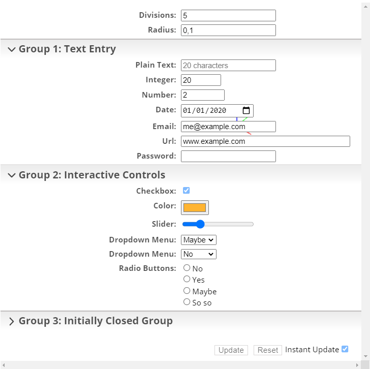
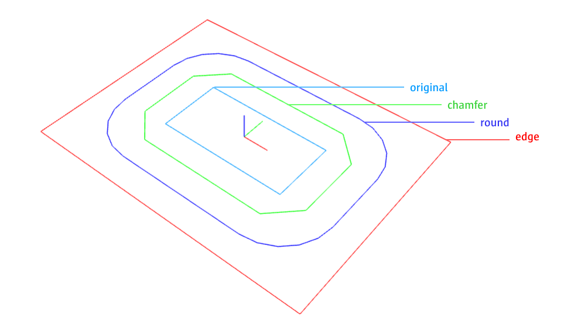
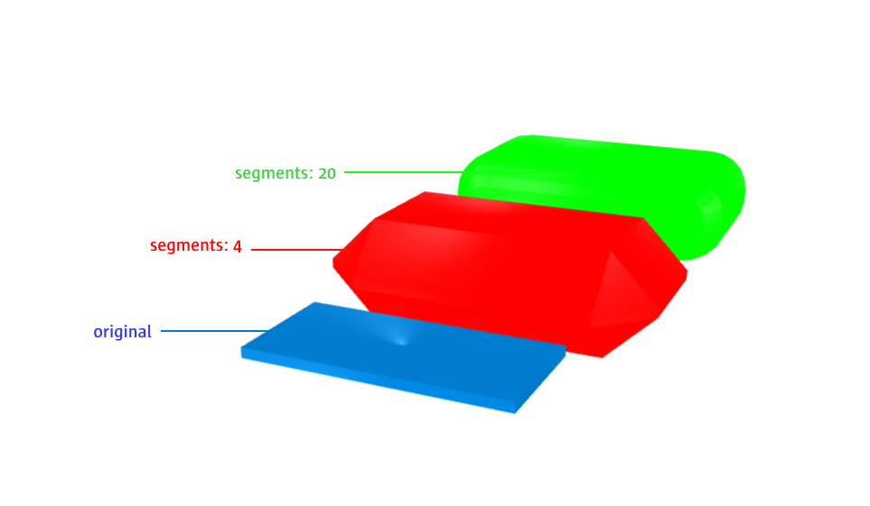
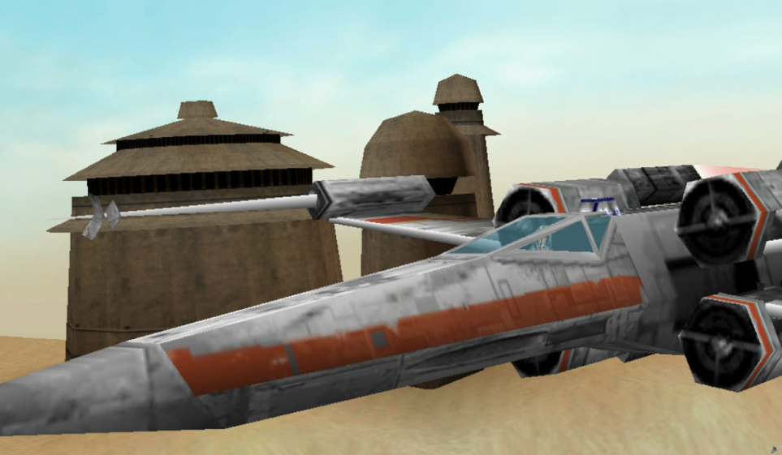
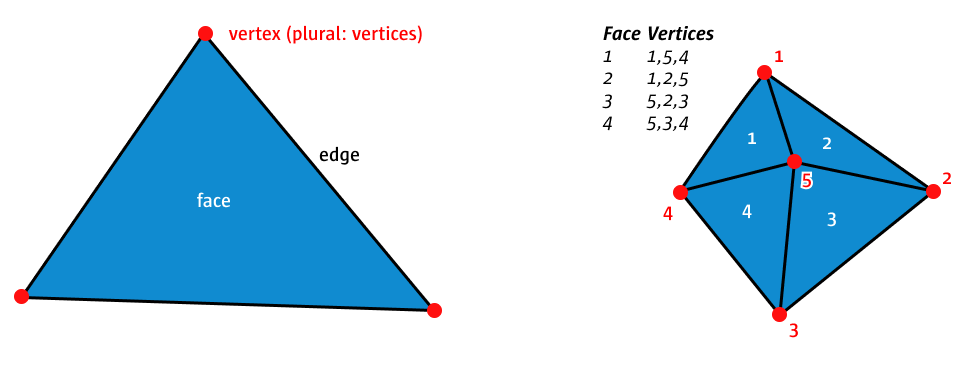

**Parametric Design**

## Parameters

<video width="1920" height="1080" style="max-width:100%; height: auto;" controls>
  <source src="https://fhp-video-hosting.s3.eu-central-1.amazonaws.com/07-3d-adv/parameters.mp4" type="video/mp4">
  Your browser does not support the video tag.
</video>

Similar to the various inputs in p5js, we can also create a list of inputs to helps us build parametric designs, that we can modify while rendering. To get started with inputs, we need to extend our boilerplat:

```js
const jscad = require('@jscad/modeling');
const {cube} = jscad.primitives;

const getParameterDefinitions = () => {
  // here we return the definitions of our parameters
  return [
    {name: 'size', caption: 'Size:', type: 'float', initial: 5},
  ];
};

// the main function now receives a parameters object
const main = (parameters) => {
  // from parameters we get all the inputs
  const cubeObject = cube({size: parameters.size});
  return cubeObject;
}

// for it to work, we also need to export the new getParameterDefinitions function
module.exports = { main, getParameterDefinitions }
```

In the `getParameterDefinitions` function we define all the inputs we need. The `name` of each input must be unique, and we use it later to retrieve it from the parameters object. The `caption` is the text written in the interface next to the input. The most import `type`s are `text`, `int`, `float`, `color`, `slider`, `checkbox`, `radio` and `choice`. With `type:'group'` your can group multiple inputs. Use it before a new group starts. The `initial` value is the value when the application starts, before you change the input.

Here is an example with all input types:

```js
const getParameterDefinitions = () => {
  return [
    { name: 'radius', type: 'float', caption: 'Radius:', initial: 0.1 },
    { name: 'group1', type: 'group', caption: 'Group 1: Text Entry' },
    { name: 'text', type: 'text', initial: '', size: 20, maxLength: 20, caption: 'Plain Text:', placeholder: '20 characters' },
    { name: 'int', type: 'int', initial: 20, min: 1, max: 100, step: 1, caption: 'Integer:' },
    { name: 'number', type: 'number', initial: 2.0, min: 1.0, max: 10.0, step: 0.1, caption: 'Number:' },
    { name: 'date', type: 'date', initial: '2020-01-01', min: '2020-01-01', max: '2030-12-31', caption: 'Date:', placeholder: 'YYYY-MM-DD' },
    { name: 'email', type: 'email', initial: 'me@example.com', caption: 'Email:' },
    { name: 'url', type: 'url', initial: 'www.example.com', size: 40, maxLength: 40, caption: 'Url:', placeholder: '40 characters' },
    { name: 'password', type: 'password', initial: '', caption: 'Password:' },
    { name: 'group2', type: 'group', caption: 'Group 2: Interactive Controls' },
    { name: 'checkbox', type: 'checkbox', checked: true, initial: '20', caption: 'Checkbox:' },
    { name: 'color', type: 'color', initial: '#FFB431', caption: 'Color:' },
    { name: 'slider', type: 'slider', initial: 3, min: 1, max: 10, step: 1, caption: 'Slider:' },
    { name: 'choice1', type: 'choice', caption: 'Dropdown Menu:', values: [0, 1, 2, 3], captions: ['No', 'Yes', 'Maybe', 'So so'], initial: 2 },
    { name: 'choice3', type: 'choice', caption: 'Dropdown Menu:', values: ['No', 'Yes', 'Maybe', 'So so'], initial: 'No' },
    { name: 'choice2', type: 'radio', caption: 'Radio Buttons:', values: [0, 1, 2, 3], captions: ['No', 'Yes', 'Maybe', 'So so'], initial: 5 },
    { name: 'group3', type: 'group', initial: 'closed', caption: 'Group 3: Initially Closed Group' },
    { name: 'checkbox2', type: 'checkbox', checked: true, initial: '20', caption: 'Optional Checkbox:' }
   ];
}
```



## Polygon

<video width="1920" height="1080" style="max-width:100%; height: auto;" controls>
  <source src="https://fhp-video-hosting.s3.eu-central-1.amazonaws.com/07-3d-adv/polygon-final.mp4" type="video/mp4">
  Your browser does not support the video tag.
</video>

```js
const {polygon} = jscad.primitives;
```

The previous session introduced the simple 2D primitives like rectangle and circle. When we want to draw more complex shapes we can use the polygon function. Think of it as the p5js' vertex function for JSCAD:

```js
const poly = polygon({
  points: [ // clockwise
    [-10, -10],
    [10, -10],
    [10, 10],
    [-10, 10],
    [-10, -10],
  ]
});
```

As the `points` attribute we pass an array of points. If you later wanto to extrude the polygon, it is important, that the points are provided in **clockwise** order.

You can also add holes to your polygon. Add the original shape to an array and then add the holes. Important: The holes are **counter-clockwise**:

```js
const poly = polygon({
  points: [
    [ // clockwise
      [-10, -10],
      [10, -10],
      [10, 10],
      [-10, 10],
      [-10, -10],
    ],
    [ // counter-clockwise
      [-5, -5],
      [-5, 5],
      [5, 5],
      [5, -5],
      [-5, -5],
    ]
  ]
});
```

## Expand & Offset

```js
const {expand, offset} = jscad.expansions;
```

In the last session we look at extrusion. Taking a shape and extending it along an axis. Another similar method is `expand` and `offset`.

### Offset

<video width="1920" height="1080" style="max-width:100%; height: auto;" controls>
  <source src="https://fhp-video-hosting.s3.eu-central-1.amazonaws.com/07-3d-adv/offset.mp4" type="video/mp4">
  Your browser does not support the video tag.
</video>

Offset can be used on 2D shapes. It simply offsets the outline by given delta. A negative delta shrinks the shape. For the corners three different types of offsets can be achieved:



```js
const rectShape = rectangle({size: [50, 25]});

const offsetShape2 = offset({
  delta: 10,
  corners: 'chamfer'
}, rectShape);

const offsetShape3 = offset({
  delta: 20,
  corners: 'round',
  segments: 20
}, rectShape);

const offsetShape1 = offset({
  delta: 30,
  corners: 'edge'
}, rectShape);
```

### Expand

**Expand for 2D**
<video width="1920" height="1080" style="max-width:100%; height: auto;" controls>
  <source src="https://fhp-video-hosting.s3.eu-central-1.amazonaws.com/07-3d-adv/expand-2d.mp4" type="video/mp4">
  Your browser does not support the video tag.
</video>

**Expand for 3D**
<video width="1920" height="1080" style="max-width:100%; height: auto;" controls>
  <source src="https://fhp-video-hosting.s3.eu-central-1.amazonaws.com/07-3d-adv/expand-3d.mp4" type="video/mp4">
  Your browser does not support the video tag.
</video>


Expand has the same `effect` as `offset` for 3D shapes. It only offers the corner method `'round'`, but you can define the segments:



```js
const rectShape = cuboid({size: [50, 25, 2]});

const offsetShape1 = expand({
  delta: 10,
  segments: 4
}, rectShape); 
```

## Polyhedrons

<video width="1920" height="1080" style="max-width:100%; height: auto;" controls>
  <source src="https://fhp-video-hosting.s3.eu-central-1.amazonaws.com/07-3d-adv/vertices.mp4" type="video/mp4">
  Your browser does not support the video tag.
</video>

```js
const {polyhedron} = jscad.primitives;
```

The last bodies we will discuss are the polyhedrons. But before a little bit of context on the construction and rendering of 3D objects. If you have used any 3D software or 3D rendered objects (e.g. in computer games), you will have noticed, if you get very close, the surfaces of objects are not very smooth, but consist of rough geometric shapes:


Image of the 1998 "Star Wars: Rogue Squadron"

Even round shapes, when observed closely consist of segments. Today those segments are harder to see, because 3D engines can easily process more segments and, therefore, generate smoother curves. At the lowest level all 3D bodies are constructed from a lot of triangles (faces). Each triangle has three points (vertices) which are connected (edges). 



Why triangles? Triangles are the most simple shape and a triangle is always flat. You cannot bend a triangle. Think about a piece of paper. If you cut out a triangle, you can move each corner up and down, but the surface will always stay even. Do the same with a square. If you only move one corner and the other three stay the same, you will bend the piece of paper and, thereby, create two triangles. Having a flat surface is for example important when you calculate how light is reflect from that surface, or how the 3D printer should construct the surface.

<video width="1920" height="1080" style="max-width:100%; height: auto;" controls>
  <source src="https://fhp-video-hosting.s3.eu-central-1.amazonaws.com/07-3d-adv/polyhedron-applied.mp4" type="video/mp4">
  Your browser does not support the video tag.
</video>

When we want to build complex custom objects ourselves, we have to think in triangles and how to construct them. To achieve this we pass a list of points (vertices) and then a list of faces, each face is defined by the index of three points. The simplest version, a triangle:

```json
{
  "points": [
    [-10, -10, 0],
    [10, -10, 0],
    [10, 10, 0]
  ],
  "faces": [
    [0, 1, 2]
  ]
}
```

A rectangle:

```json
{
  "points": [
    [-10, -10, 0],
    [10, -10, 0],
    [10, 10, 0],
    [-10, 10, 0]
  ],
  "faces": [
    [0, 1, 2],
    [2, 3, 1]
  ]
}
```

Notice that the above faces use the points multiple times. So instead of having 6 points, 3 for each of the two triangles in the points array. We only provide the really neccessary points and than reuse them. This is not a requirement, the following would create the same shape:

```json
{
  "points": [
    [-10, -10, 0],
    [10, -10, 0],
    [10, 10, 0],
    [10, 10, 0],
    [-10, 10, 0],
    [-10, -10, 0]
  ],
  "faces": [
    [0, 1, 2],
    [3, 4, 5]
  ]
}
```

If we provide each point individually, we have to make sure that they are correctly aligned. Otherwise, we will have holes in the surface of our body later on, which will for example create problems when we want to send it to a 3D-printer.

To make it even more tricky, the order of points needs to be clockwise if you look from the outside onto a face. :)

This is a lot to take in, but it gives you the ultimate power over any 3D shape that you would like to create. Its usually best to start with a sketch and figuring out, how to best structure our faces:

<video width="1920" height="1080" style="max-width:100%; height: auto;" controls>
  <source src="https://fhp-video-hosting.s3.eu-central-1.amazonaws.com/07-3d-adv/3d-adv-example-1.mp4" type="video/mp4">
  Your browser does not support the video tag.
</video>


```js
const jscad = require('@jscad/modeling');

const {polyhedron} = jscad.primitives;

function polar(radius, angle) {
  const rad = Math.PI / 180 * angle;
  const x = radius * Math.cos(rad);
  const y = radius * Math.sin(rad);
  return {x, y};
}

const main = () => {


  const height = 50;

  const top = [0, 0, height];
  const bottom = [0, 0, -height];

  const numPoints = 5;
  const radius = 4;

  const points = [top, bottom];

  for (let p = 0; p < numPoints; p += 1) {
    const point = polar(radius, 360 / numPoints * p);
    points.push([point.x, point.y, 0]);
  }

  const faces = [];

  for (let p = 0; p < numPoints; p += 1) {
    // top
    let p1 = p + 2;
    let p2 = p + 3;
    let p3 = 0;
    if (p === numPoints - 1) {
      p2 = 2;
    }
    faces.push([p1, p2, p3]);

    // bottom
    p3 = 1;
    faces.push([p3, p2, p1]); 
  }

  let shape = polyhedron({
    points: points,
    faces: faces,
    orientation: 'outward'
  });

  return shape;
};

module.exports = { main };
```


Here is another example which introduces some randomness to generate a rugged surface:

<video width="1920" height="1080" style="max-width:100%; height: auto;" controls>
  <source src="https://fhp-video-hosting.s3.eu-central-1.amazonaws.com/07-3d-adv/example-2.mp4" type="video/mp4">
  Your browser does not support the video tag.
</video>


```js
const jscad = require('@jscad/modeling');

const {polyhedron, cuboid} = jscad.primitives;
const {union} = jscad.booleans;

const main = () => {
  const rectHeight = 1;
  const stepSize = 1;
  const numPoints = 41;
  const maxHeight = 2;
  const width = 5;
  const points = [];
  const faces = [];

  for (let p = 0; p < numPoints; p += 1) {
    const y = p * stepSize;
    let z1 = 0;
    let z2 = 0;
    if (p%2 !== 0) {
      z1 = Math.random() * maxHeight;
      z2 = Math.random() * maxHeight;
    }
    points.push([0, y, z1]);
    points.push([width, y, z2]);
  }

  // faces of the sides
  for (let p = 0; p < points.length - 4; p += 4) {
    faces.push([
      p, p+2, p + 4
    ]);
    faces.push([
      p+5, p+3, p + 1
    ]);
  }

  // bottom
  for (let p = 0; p < points.length - 2; p += 4) {
    faces.push([
      p + 4, p + 1, p
    ]);
    faces.push([
      p + 1, p + 4, p + 5 
    ]);
  }

  // top
  for (let p = 0; p < points.length - 2; p += 2) {
    faces.push([
      p, p + 1, p + 2
    ]);
    faces.push([
      p + 3, p + 2, p + 1 
    ]);
  }

  let shape = polyhedron({
    points: points,
    faces: faces,
    orientation: 'outward'
  });

  let rect = cuboid({
    size: [width, stepSize * numPoints, rectHeight],
    center: [width / 2, stepSize * numPoints / 2, -rectHeight/2]
  });
  return union([rect, shape]);
};

module.exports = { main };
```


Last slightly more complex. Building upon the polar coordinate system, the following takes this a step further and introduces a spherical coodinate system. Generating points on a spherical surface and then connects those.

```js
function polar(radius, angle) {
  const rad = Math.PI / 180 * angle;
  const x = radius * Math.cos(rad);
  const y = radius * Math.sin(rad);
  return {x, y};
}

const points = [];
const faces = [];
const divisions = 5;
const radius = 50;
  
for (let d1 = 0; d1 < divisions; d1 += 1) {
  const p1 = polar(radius, 180 / (divisions - 1) * d1);
  for (let d2 = 0; d2 < divisions; d2 += 1) {
    const p2 = polar(p1.y, 360 / divisions * d2);
    points.push([p2.y, p2.x, p1.x]);
  }
}

let count = 0;
for (let d1 = 0; d1 < divisions - 1; d1 += 1) {
  for (let d2 = 0; d2 < divisions; d2 += 1) {
    if (d2 === divisions - 1) {
      faces.push([
        count,
        count + 1,
        divisions * d1,
      ]);
      faces.push([
        divisions * (d1 + 2) - 1,
        count + 1,
        count,
      ]);
    } else {
      faces.push([
        count + divisions,
        count + 1,
        count
      ]);
      faces.push([
        count + divisions,
        count + divisions + 1,
        count + 1
      ]);
    }
    count += 1;
  }
}

let shape = polyhedron({
  points: points,
  faces: faces,
  orientation: 'outward'
});
```


